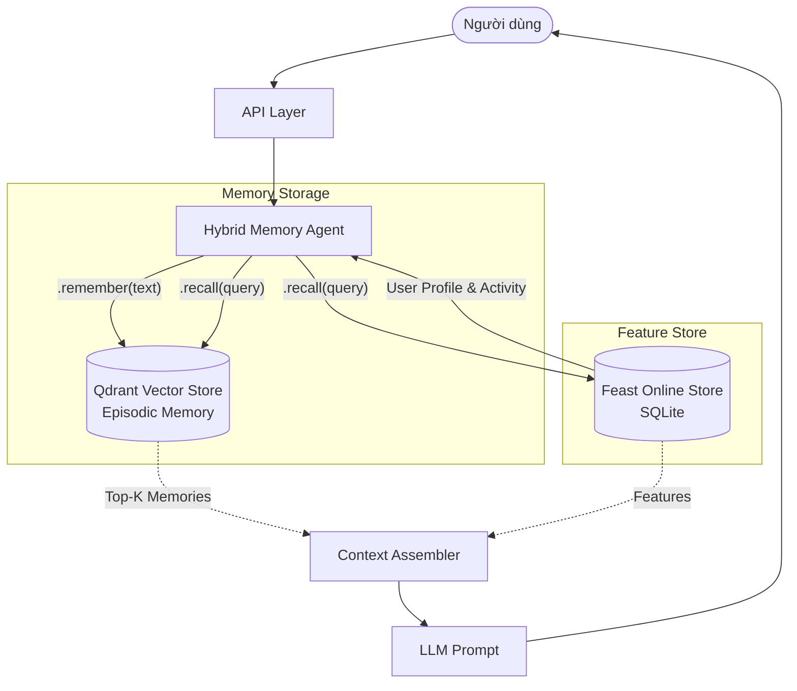

# Hybrid Memory Agent Architecture

## Kiến trúc Hệ thống (Architecture Diagram)

## Các Quyết Định Kiến Trúc (Architecture Decisions)

### 1. Chunking Strategy: Semantic Boundary Chunking vs Fixed-Size Chunking
- **Xem xét (Y - Fixed-size chunking):** Cắt văn bản theo kích thước cố định (vd: 500 tokens/chunk). Dễ triển khai, nhanh, chi phí tính toán thấp.
- **Lựa chọn (X - Semantic Boundary Chunking):** Chunk theo ngữ nghĩa (per-message trong hội thoại, hoặc theo đoạn văn).
- **Tradeoff & Lý do:** Fixed-size thường cắt ngang câu hoặc đoạn hội thoại, làm mất ngữ cảnh (đặc biệt trong tiếng Việt khi đại từ nhân xưng phụ thuộc mạnh vào câu trước). Semantic chunking tốn chi phí tính toán và logic phức tạp hơn (chi phí storage có thể tăng nhẹ do overlap), nhưng bù lại chất lượng Retrieval (retrieval quality) tăng đáng kể vì mỗi chunk giữ trọn vẹn một ý niệm (episodic event). Đối với Personal Memory, chất lượng tìm kiếm quan trọng hơn chi phí lưu trữ, do đó X là lựa chọn phù hợp.

### 2. Feature Schema: Tabular/Explicit Features vs Latent Embedding Features
- **Xem xét (Y - Latent Embedding Features):** Lưu toàn bộ sở thích người dùng dưới dạng một vector embedding tổng hợp, biểu diễn toàn bộ "con người" họ trong latent space.
- **Lựa chọn (X - Tabular/Explicit Features):** Sử dụng các đặc trưng rõ ràng dạng bảng (tabular) như `reading_speed_wpm`, `preferred_language`, `topic_affinity`.
- **Tradeoff & Lý do:** Embedding features lưu được sở thích ngầm rất tốt và tự động hoá được phần học máy, nhưng lại biến hành vi người dùng thành một hộp đen (blackbox), khó debug và khó cho phép người dùng tự chỉnh sửa (ví dụ: người dùng muốn đổi "ngôn ngữ ưu tiên" từ tiếng Anh sang tiếng Việt). Tabular features yêu cầu feature engineering rõ ràng hơn, bị giới hạn ở các dimensions định trước, nhưng lại tường minh (explainable), cho phép LLM dễ dàng reasoning ("Vì bạn thích Cloud, tôi khuyên bạn..."). Trong bối cảnh trợ lý cá nhân, sự minh bạch là cần thiết để LLM sinh ra lời giải thích tự nhiên.

### 3. Freshness Strategy: Push-based Streaming vs Batch Refresh
- **Xem xét (Y - Batch Refresh):** Cập nhật dữ liệu profile mỗi ngày (daily batch) hoặc mỗi giờ.
- **Lựa chọn (X - Push-based Streaming cho Activity + Batch cho Profile):** Chia làm hai luồng. `user_profile` (ngôn ngữ, tốc độ) chạy batch daily. Nhưng `query_velocity` và `recent_topics` (hoạt động gần đây) được cập nhật bằng Push API gần như tức thời (sub-second).
- **Tradeoff & Lý do:** Batch refresh rất rẻ và ổn định, nhưng làm mất tính "real-time" - nếu người dùng vừa chuyển sang hỏi về y tế liên tục trong 10 phút qua, batch daily sẽ hoàn toàn mù mờ về điều này. Streaming push đắt đỏ hơn về mặt hạ tầng và phức tạp trong việc duy trì online store (phải duy trì pipeline kafka/redis streaming), nhưng mang lại trải nghiệm "trợ lý đang lắng nghe tôi ngay lúc này" rất tự nhiên. 

## Lựa Chọn Thay Thế Bị Loại Bỏ (Rejected Alternative)
**Lưu trữ Episodic Memory bên trong Feature Store (như một Feature View dạng list/vector):**
Tôi đã xem xét việc nhúng luôn lịch sử tin nhắn (episodic memory) vào trong Feature Store (sử dụng Feast với kiểu dữ liệu Vector/List). Tuy nhiên, lựa chọn này bị loại bỏ vì **chu kỳ re-index và cơ chế truy vấn hoàn toàn khác biệt**. Feature Store (online) sinh ra để O(1) key-value lookup theo `user_id`. Trong khi đó, Episodic Memory đòi hỏi Approximate Nearest Neighbor (ANN) search theo semantic similarity. Ép vector search vào một key-value store sẽ làm hỏng hiệu năng của cả hai. Do đó, tách riêng Qdrant cho Vector Search và Feast cho Key-Value Profile là một quyết định kiến trúc đúng đắn.

## Yếu Tố Ngữ Cảnh Việt Nam (Vietnamese-Context Considerations)
- **Code-switching (Vi/En Mix):** Người dùng Việt Nam thường xuyên pha trộn tiếng Việt và tiếng Anh ("Mình deploy lên cloud bằng kubernetes nhé"). Mô hình embedding được chọn cần phải là mô hình Multilingual (như `intfloat/multilingual-e5-small`) thay vì chỉ mô hình monolingual tiếng Việt để xử lý tốt sự pha trộn này.
- **Vấn đề Tokenization tiếng Việt:** Chữ tiếng Việt chứa khoảng trắng giữa các âm tiết (ví dụ: "máy học" là 1 từ nhưng 2 âm tiết). Việc sử dụng whitespace split truyền thống của tiếng Anh sẽ phá vỡ ngữ nghĩa. Quyết định kiến trúc là phải sử dụng các tokenizer đặc thù (như `pyvi` hoặc `underthesea`) để word segmentation trước khi chunking và nhúng (embedding), nhằm bảo toàn ngữ nghĩa của các từ ghép tiếng Việt, giúp retrieval chính xác hơn.

## Giới Hạn Hiện Tại (Honest Limitations / What this POC doesn't handle yet)
- **Multi-user Privacy Isolation:** POC này hiện lưu trữ vector chung một collection và chỉ lọc bằng lệnh (`Filter` theo `user_id` ở logic application). Trong production thực tế, cần cơ chế rạch ròi hơn như Multi-tenancy isolation bằng tenant ID của Qdrant hoặc mã hoá (encryption at rest) cấp độ người dùng để tuân thủ quyền riêng tư dữ liệu (đặc biệt là theo Nghị định 13 về bảo vệ dữ liệu cá nhân tại Việt Nam).
- **Memory Decay (Quên lãng):** Hiện tại hệ thống "nhớ" mọi thứ vô thời hạn. Một con người thật sẽ dần quên các chi tiết nhỏ. Cần một cơ chế TTL cho episodic memory hoặc LLM-based memory consolidation (tóm tắt định kỳ các memory cũ và xoá raw text).
- **CRUD on Memories:** Không có cơ chế để người dùng chủ động xoá đi một ký ức sai lệch hoặc cập nhật lại khi thông tin thay đổi.

---
**Vibe coding workflow log:**
Prompt hiệu quả: "Generate a python class for HybridMemoryAgent that takes an input query, gets top 3 semantically matched chunks from an in-memory Qdrant, looks up user profile from a local Feast SQLite store, and returns a formatted context string. Do not generate the LLM call, only the context assembly."
Prompt ít hiệu quả: "Write the whole bonus challenge for me" (Tạo ra các architecture decisions rất chung chung và thiếu chiều sâu về tradeoff).
